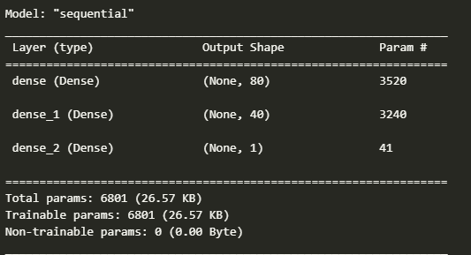
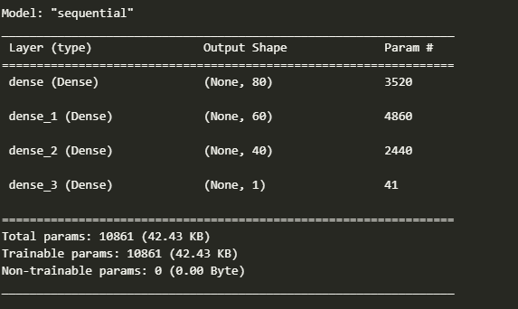

# deep-learning-challenge

## Overview of the Analysis

* The nonprofit foundation Alphabet Soup wants a tool that can help it select the applicants for funding with the best chance of success in their ventures. With your knowledge of machine learning and neural networks, you’ll use the features in the provided dataset to create a binary classifier that can predict whether applicants will be successful if funded by Alphabet Soup.

* From Alphabet Soup’s business team, you have received a CSV containing more than 34,000 organizations that have received funding from Alphabet Soup over the years. Within this dataset are a number of columns that capture metadata about each organization, such as:

    * EIN and NAME—Identification columns
    * APPLICATION_TYPE—Alphabet Soup application type
    * AFFILIATION—Affiliated sector of industry
    * CLASSIFICATION—Government organization classification
    * USE_CASE—Use case for funding
    * ORGANIZATION—Organization type
    * STATUS—Active status
    * INCOME_AMT—Income classification
    * SPECIAL_CONSIDERATIONS—Special considerations for application
    * ASK_AMT—Funding amount requested
    * IS_SUCCESSFUL—Was the money used effectively

* I am trying to predict variable IS_SUCCESSFUL.
* Stages of the machine learning process:
    * Preprocessing
    * Compile, train and evaluate the model

* Method used was neural networks with tensorflow library

## Results

* Machine Learning Model - Original:
    * Original model with 2 hidden layers.
	* 
    * Loss: 0.5572, Accuracy: 0.7318

* Machine Learning Model - Optimization Trial 1:
    * Attempt to optimize model by increasing number of bins for APPLICATION_TYPE and CLASSIFICATION. 
    * Loss: 0.5561, Accuracy: 0.7305

* Machine Learning Model - Optimization Trial 2:
    * Attempt to optimize by dropping STATUS and SPECIAL_CONSIDERATIONS columns.
    * Loss: 0.5569, Accuracy: 0.7213

* Machine Learning Model - Optimization Trial 3:
    * Attempt to optimize by adding third hidden layer.
    
    * Loss: 0.5548, Accuracy: 0.7311

## Summary

* There were no improvements on loss or accuracy with the optimization attempts made. Accuracy remains around 73% at best, which seems mediocre to me. 
